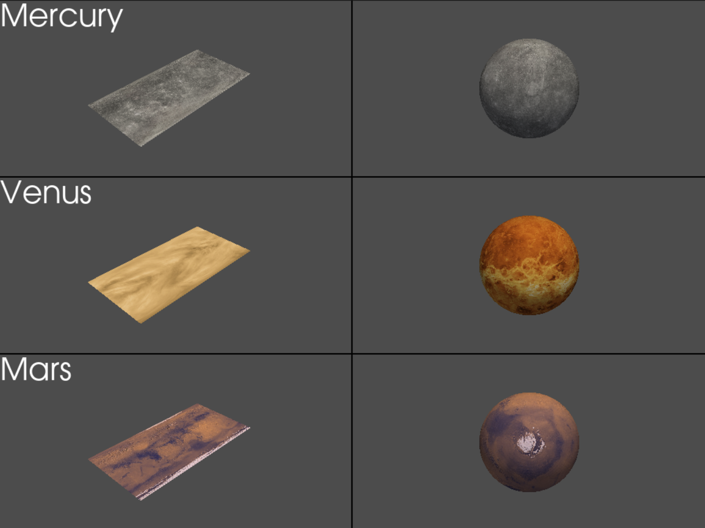

Understanding pyvista and vispy

https://vispy.org/gallery/gloo/rotating_quad.html

https://docs.pyvista.org/examples/99-advanced/planets.html#sphx-glr-examples-99-advanced-planets-py


PyVista and VisPy are two Python libraries used for scientific visualization and 3D graphics. Here is a brief overview of each library and how to get started using them:

## PyVista
PyVista is an open-source library for 3D visualization that is built on top of the Visualization Toolkit (VTK). It provides an interface for working with VTK data structures and a high-level API for generating 3D visualizations in Python. PyVista supports a wide range of data formats, including common scientific file formats like STL, OBJ, and VTK, as well as many other file types.

Getting Started with PyVista
To get started with PyVista, you can install it using pip:

```
pip install pyvista
```
Once installed, you can use PyVista to create 3D visualizations in Python. Here's a simple example:

```
import pyvista as pv

# create a simple mesh
mesh = pv.Sphere()

# plot the mesh
mesh.plot()
```

This code will create a simple 3D sphere and display it in a new window. PyVista provides many other tools for manipulating and visualizing 3D data, including mesh smoothing, volume rendering, and more.

## VisPy
VisPy is another open-source library for 3D visualization that is built on top of OpenGL. It provides a low-level interface for working with GPU-accelerated graphics and a high-level API for creating 3D visualizations in Python. VisPy is designed to be fast and flexible, making it a popular choice for interactive scientific visualizations and real-time graphics applications.

Getting Started with VisPy
To get started with VisPy, you can install it using pip:
```
pip install vispy
```

Once installed, you can use VisPy to create 3D visualizations in Python. Here's a simple example:

```
import vispy.scene as scene
import numpy as np

# create a canvas
canvas = scene.SceneCanvas(keys='interactive', bgcolor='white')

# create a 3D axis
view = canvas.central_widget.add_view()

# create a sphere
sphere = scene.visuals.Sphere(radius=1, method='latitude', parent=view.scene)

# set the camera position
view.camera = scene.TurntableCamera()

# show the canvas
canvas.show()

# start the event loop
import sys
if sys.flags.interactive != 1:
    scene.app.run()
```

This code will create a simple 3D sphere and display it in a new window. VisPy provides many other tools for manipulating and visualizing 3D data, including mesh rendering, lighting, and more.

## Conclusion
PyVista and VisPy are two powerful Python libraries for scientific visualization and 3D graphics. They provide different levels of abstraction and support different data formats and use cases. By using these libraries, you can create interactive and high-quality 3D visualizations in Python.